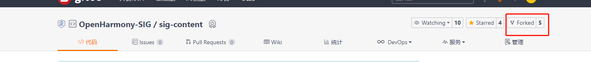
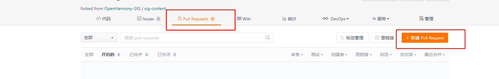

社区开发者对SIG组下已有的仓库修改，统一采用向对应仓库提PR的方式来做修改，相关的gitee操作请参考此[链接](https://gitee.com/help/articles/4128#article-header0)。下面以sig-content仓为例。用到的命令有以下几条：

``` shell
git clone <仓库地址>
git checkout -b <分支名>
git add .
git commit -s -m "自定义commit信息"
git push origin <分支名>
```

1. 首先需要保证提PR的gitee账号已经在[链接](https://dco.openharmony.io/sign/Z2l0ZWUlMkZvcGVuX2hhcm1vbnk=)中签署DCO

2. fork [openharmony-sig 组织](https://gitee.com/openharmony-sig)下准备修改的仓库。




3. 在本地找一个自己的工作目录，右键 git bash here 调出git 命令窗口，采用git clone 命令克隆第2步中fork的仓库。
4. 默认打开的是master分支，建议使用git checkout -b  <分支名>  新建一个分支来工作。
5. 增加了自己的修改后，使用git  add .  命令来将新增的修改添加到git本地的缓存区。
6. 新增的修改添加到git本地的缓存区后，使用git commit -s -m "自定义commit信息"将缓存区内容添加到本地仓库。
7. 最后使用git push origin <分支名>将指定分支的本地仓库内容推到远端仓库
8. 进入远端fork 的仓库，点击新建PR,选择第7步中提交的分支。

9.  如果提交的PR显示DCO检查成功，等待管理员审核通过即可，如果DCO检查失败，请确认是否签署DCO。

