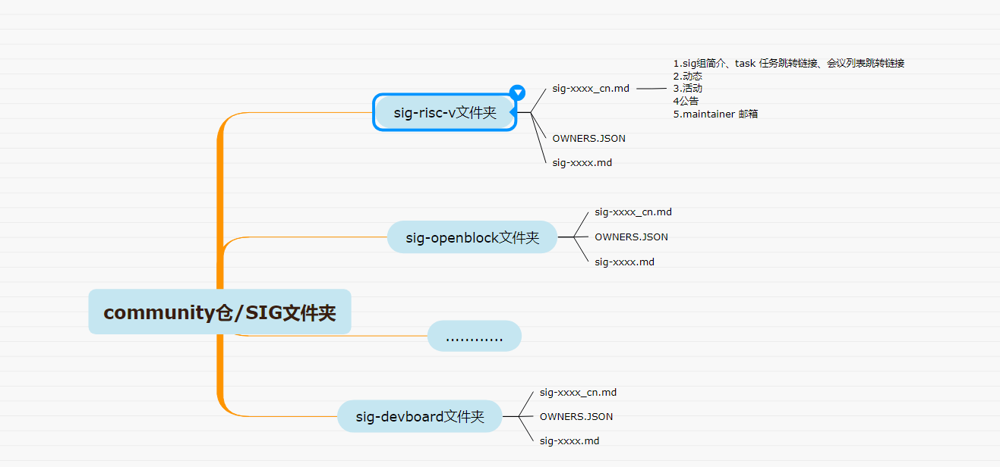
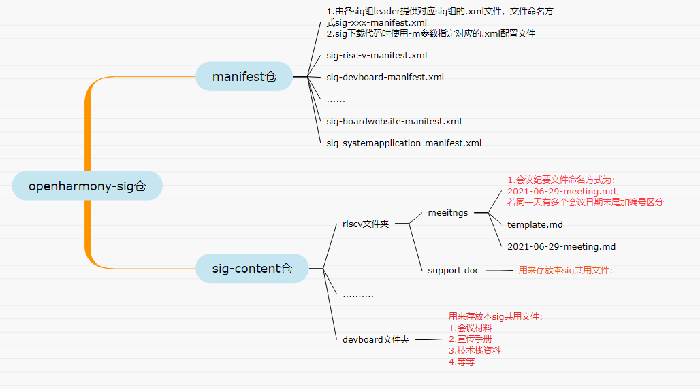

#  一、 sig 总入口

* 在[openharmony组织](https://gitee.com/openharmony)下的[community](https://gitee.com/openharmony/community)仓的sig文件夹中列出了社区所有已成立的sig组，在每个文件夹中包含了所属sig的leader、committer、代码仓地址等信息

# 二、 sig 代码/文档管理

* 关于sig组的代码，在[openharmony-sig组织](https://gitee.com/openharmony-sig/)下的[manifest仓](https://gitee.com/openharmony-sig/manifest)统一用manifest的形式来管理，每个子任务编写自己对应的.xml文件来组织相关代码

* 关于sig组的文档，分两类：

1. 和代码紧密相关的文档放到对应的代码仓即可

2. sig下的公共文档（例如：宣传文档，任务列表等），放到[openharmony-sig组织](https://gitee.com/openharmony-sig/)下的，[sig-content仓](https://gitee.com/openharmony-sig/sig-content)

# 三、任务进度的维护

  1. 任务进度以在对应任务仓下提issue形式更新。

  2. 作为跟踪进度的issue需要打上特定的标签，标签定为 **milestone**。

